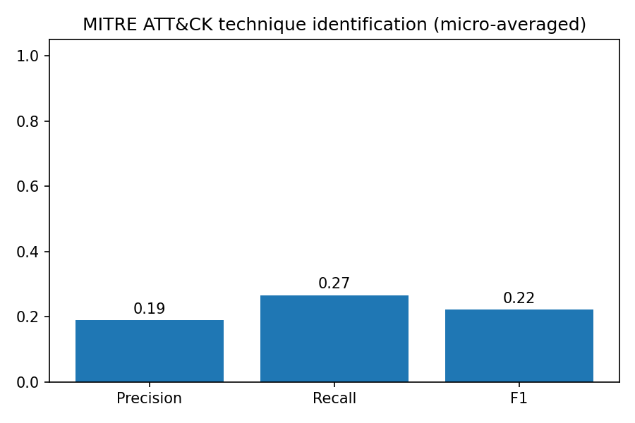
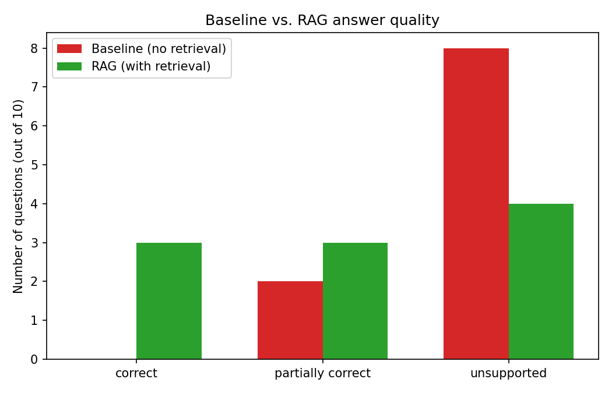

# AI Foundation Models Lab

A hands-on learning lab for understanding **foundation models** across two domains: time-series forecasting and security-specialized LLMs. The goal throughout is not to build a product -- it's to build intuition, and to actually run every experiment rather than reason about it in the abstract: what "zero-shot" really means, how a pretrained model degrades under stress, how you'd build an evaluation harness before trusting one, what retrieval-augmented generation actually changes, and what fine-tuning does and doesn't buy you.

Every number in this README comes from a notebook that was actually executed end-to-end on the machine described in [Setup](#setup) -- nothing here is estimated or asserted without a corresponding run.

## What's here

| Notebook | What it does |
|---|---|
| [`00_verify_setup.ipynb`](notebooks/00_verify_setup.ipynb) | Verifies the environment and confirms CTSM can be imported and loaded. |
| [`01_ctsm_forecasting.ipynb`](notebooks/01_ctsm_forecasting.ipynb) | Baseline zero-shot time-series forecasting experiment. |
| [`02_ctsm_robustness.ipynb`](notebooks/02_ctsm_robustness.ipynb) | Three controlled stress tests: noise, missing data, anomalies. |
| [`03_security_foundation_model.ipynb`](notebooks/03_security_foundation_model.ipynb) | Loads Cisco Foundation AI's security-specialized LLM locally and runs first prompts. |
| [`04_security_model_evaluation.ipynb`](notebooks/04_security_model_evaluation.ipynb) | A small but real evaluation harness: golden dataset, classification accuracy, MITRE ATT&CK precision/recall, hallucination checks. |
| [`05_security_rag.ipynb`](notebooks/05_security_rag.ipynb) | Retrieval-augmented generation against a synthetic security-policy knowledge base, compared against prompting alone. |
| [`06_llm_finetuning_lora.ipynb`](notebooks/06_llm_finetuning_lora.ipynb) | LoRA fine-tuning of a small (494M) general-purpose model on a narrow security classification task. |
| [`06_security_finetuning_lora_mlx.ipynb`](notebooks/06_security_finetuning_lora_mlx.ipynb) | The same fine-tuning experiment, on the actual 8B security-specialized model, via Apple's MLX framework. |

---

## Track 1: Time-Series Foundation Model (CTSM)

CTSM 1.0 is a 250M-parameter, Apache-2.0 licensed, decoder-only transformer released by Cisco/Splunk for **univariate zero-shot time-series forecasting** -- used here exactly as published, no training or fine-tuning. Loaded via the `cisco-tsm` PyPI package, running locally on CPU/Apple Silicon (MPS).

**Baseline (01):** a synthetic CPU-utilization series (trend + daily cycle + noise) is forecast zero-shot over a 128-point held-out window.

**Result: MAE 2.176 / RMSE 2.854 (percentage points of CPU).**


**Robustness (02):** three stressors, tested one at a time against that same baseline.

- **Noise** -- error grows substantially and smoothly as injected noise increases (sigma 3 -> 15: MAE 2.18 -> 10.81).
- **Missing data** -- a gap is explicitly imputed via last-value-carried-forward (the method CTSM's own model card recommends) and clearly flagged, not hidden. Error rose *non-monotonically* across gap sizes (10% missing scored worse than 25%) -- reported as observed, not smoothed into a trend that isn't there.
- **Anomaly** -- a large spike injected just before the forecast window measurably shifted the forecast (+1.50 MAE) relative to the clean baseline.


---

## Track 2: Security-Domain Foundation Model (Foundation-Sec)

[Foundation-Sec-1.1-8B-Instruct](https://huggingface.co/fdtn-ai/Foundation-Sec-1.1-8B-Instruct) is Cisco Foundation AI's 8B-parameter, Llama-3.1-based model continued-pretrained on cybersecurity content. Run entirely locally via a **Q4_K_M GGUF quantization** and `llama-cpp-python` with Metal acceleration (03-05) -- full-precision weights alone would need ~16GB, more than this machine's unified memory has room for alongside everything else.

### Loading and first prompts (03)

Confirms the model loads and runs three simple SOC-style prompts (triage, MITRE mapping, containment recommendations) before any formal evaluation is attempted.

### Building an evaluation harness (04)

A 12-scenario synthetic golden dataset (brute force, phishing, ransomware, lateral movement, a deliberately benign case, and more), each scored for classification accuracy, MITRE ATT&CK technique precision/recall, and evidence grounding.

- **Classification accuracy: 83.3%** (10/12).
- **MITRE technique precision/recall/F1: 0.19 / 0.27 / 0.22** -- the model both over- and under-predicts techniques simultaneously; several overpredicted IDs were technique numbers MITRE deprecated years ago, a specific, checkable pattern rather than random noise.
- **Grounding: 58% fully grounded, 42% unsupported, and -- across all 12 responses -- zero fabricated IPs, usernames, filenames, timestamps, or commands.** Where the model was wrong, it was vague, not confidently inventing facts.



### Retrieval-augmented generation (05)

A small synthetic security-policy knowledge base (5 markdown documents: incident response, authentication, endpoint response, threat intel handling, asset criticality) with a hand-rolled TF-IDF retriever -- deliberately not a vector database, to keep every step inspectable.

- **Baseline (no retrieval): 0/10 questions correct.** The model cannot know these organization-specific facts (specific approval thresholds, rotation periods, response-time SLAs) and would occasionally state a confident, specific, wrong number instead of declining.
- **With retrieval: 3/10 correct, 3/10 partial.** Retrieval found the relevant policy document 90% of the time.
- A genuine, unexpected finding surfaced by checking raw model output rather than trusting the scoring: 4 of the "wrong" RAG answers were **literally empty completions** (zero tokens generated), a distinct and arguably more dangerous failure mode than a wrong-but-visible answer -- verified independently before being written up, not assumed.



### Fine-tuning (06, two variants)

Both notebooks fine-tune a narrow 3-way security classification task (BENIGN / SUSPICIOUS / MALICIOUS) with **LoRA**, on the identical 45-example synthetic dataset, so the two are directly comparable:

| | Model | Params | Framework | Validation accuracy: base -> LoRA | Generalization accuracy: base -> LoRA |
|---|---|---|---|---|---|
| [`06_llm_finetuning_lora.ipynb`](notebooks/06_llm_finetuning_lora.ipynb) | Qwen2.5-0.5B-Instruct (general-purpose) | 494M | `transformers` + `peft` | 33% -> 67% | 33% -> 67% |
| [`06_security_finetuning_lora_mlx.ipynb`](notebooks/06_security_finetuning_lora_mlx.ipynb) | Foundation-Sec-1.1-8B-Instruct (security-specialized) | 8.03B | MLX + `mlx-lm` (4-bit) | 100% -> 100% | 83% -> 83% |

The comparison is itself the finding: the general-purpose model needed fine-tuning to get anywhere useful on this task; the security-specialized model was already excellent at it zero-shot, and fine-tuning had essentially nothing left to improve. Getting the second row required actually diagnosing two real bugs along the way (a LoRA scale-convention mismatch between `peft` and MLX, and a learning rate 20x too high for MLX's convention) rather than accepting the first broken result -- both are documented in the notebook exactly as found.


**Why MLX, not the standard `transformers` + `peft` + `bitsandbytes` path used for the small model:** `bitsandbytes`' Apple Metal backend is marked "under construction" in its own official compatibility table (checked directly). MLX is Apple's own array framework, built for exactly this unified-memory hardware, and its `mlx-lm` library supports LoRA on 4-bit-quantized models natively.

---

## Important caveats

Every experiment here is **exploratory, not a benchmark**:

- CTSM's experiments run on one synthetic, single-seed series; nothing is claimed to generalize past the exact settings tested (notebook 02's own "Observations" section states this explicitly).
- The security golden dataset (12 scenarios) and RAG questions (10) are small and hand-authored by one person, not reviewed by a SOC analyst or drawn from real incidents.
- Fine-tuning used ~36-45 synthetic training examples -- enough to demonstrate the mechanism, not to certify production classification behavior.
- No customer data, no real threat intelligence, and no real vulnerability data appear anywhere in this repo; every IP address uses RFC 5737 documentation ranges, every CVE-shaped identifier in notebook 04 is an explicitly fictional placeholder, and every policy document is marked synthetic in its own text.
- `Foundation-Sec-1.1-8B-Instruct-mlx-4bit` (used in the MLX fine-tuning notebook) is a third-party community conversion, not an official Cisco/Foundation AI release -- the underlying weights and license terms were verified to match the official model, but the conversion itself is unaudited here.

## Setup

Requires Python 3.11 (a hard constraint of the `cisco-tsm` package).

```bash
python3.11 -m venv .venv
source .venv/bin/activate
pip install -r requirements.txt
python -m ipykernel install --user --name=ai-foundation-models-lab --display-name "Python 3.11 (ai-foundation-models-lab)"
```

Then open any notebook in Jupyter and select the **"Python 3.11 (ai-foundation-models-lab)"** kernel. Model weights download from Hugging Face on first run and are cached locally afterward (CTSM ~250M params; Foundation-Sec GGUF ~4.9GB; Foundation-Sec MLX 4-bit ~4.5GB; Qwen2.5-0.5B ~1GB).

This lab intentionally uses several different local-inference approaches depending on what each notebook needed, all installed by the one `requirements.txt`:

- `cisco-tsm` (notebooks 00-02) -- PyTorch/MPS, for a 250M model.
- `llama-cpp-python` (notebooks 03-05) -- GGUF quantized inference via Metal, for the 8B security model (full precision wouldn't fit in 16GB).
- `transformers` + `peft` (notebook 06) -- standard LoRA fine-tuning, for a 494M model where full-precision weights comfortably fit.
- `mlx` + `mlx-lm` (notebook 06 MLX variant) -- Apple's native framework, the only path found that supports LoRA fine-tuning of a 4-bit-quantized 8B model on this hardware.

## Project structure

```
ai-foundation-models-lab/
│
├── README.md
├── LICENSE
├── requirements.txt
├── .gitignore
│
├── data/
│   └── security_knowledge/          # synthetic policy docs used by notebook 05's RAG index
│       ├── incident_response_policy.md
│       ├── authentication_policy.md
│       ├── endpoint_response_policy.md
│       ├── threat_intelligence_policy.md
│       └── asset_criticality.md
│
├── notebooks/
│   ├── 00_verify_setup.ipynb
│   ├── 01_ctsm_forecasting.ipynb
│   ├── 02_ctsm_robustness.ipynb
│   ├── 03_security_foundation_model.ipynb
│   ├── 04_security_model_evaluation.ipynb
│   ├── 05_security_rag.ipynb
│   ├── 06_llm_finetuning_lora.ipynb
│   └── 06_security_finetuning_lora_mlx.ipynb
│
├── results/                          # all plots referenced above, plus a few more per-notebook
│
└── scripts/
    └── make_robustness_summary_plot.py
```
