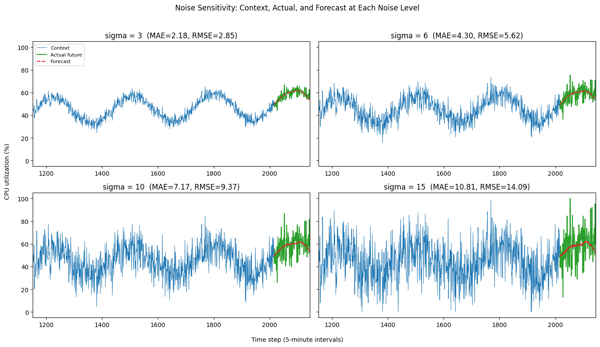
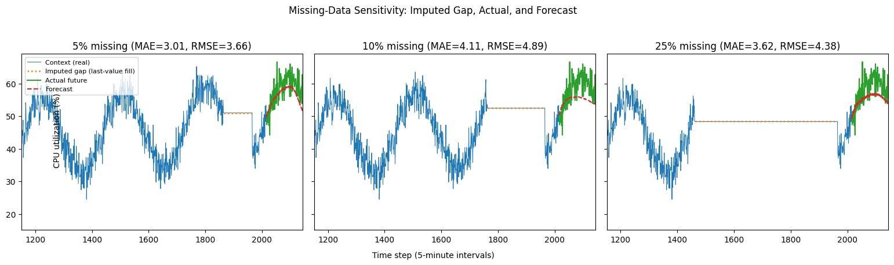
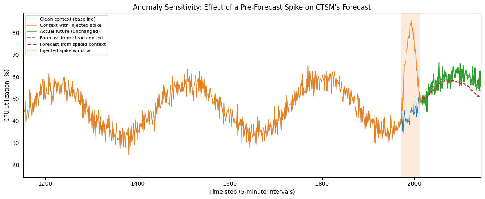

# AI Foundation Models Lab

A hands-on learning lab for understanding **time-series foundation models**, using [Cisco Time Series Model 1.0](https://huggingface.co/cisco-ai/cisco-time-series-model-1.0) (CTSM) as the concrete example.

The goal is not to build a product -- it's to build intuition: what "zero-shot forecasting" actually means in practice, how a pretrained foundation model behaves on a controlled signal, and how it degrades under noise, missing data, and anomalies.

## What's here

| Notebook | What it does |
|---|---|
| [`00_verify_setup.ipynb`](notebooks/00_verify_setup.ipynb) | Verifies the environment and confirms CTSM can be imported and loaded. No forecasting yet. |
| [`01_ctsm_forecasting.ipynb`](notebooks/01_ctsm_forecasting.ipynb) | The baseline zero-shot forecasting experiment. |
| [`02_ctsm_robustness.ipynb`](notebooks/02_ctsm_robustness.ipynb) | Three controlled stress tests against that baseline: noise, missing data, anomalies. |

## The model

CTSM 1.0 is a 250M-parameter, Apache-2.0 licensed, decoder-only transformer released by Cisco/Splunk for **univariate zero-shot time-series forecasting** -- it ships pretrained and is used here exactly as published, with no training or fine-tuning. All experiments load it via the `cisco-tsm` PyPI package, pointed at the `cisco-ai/cisco-time-series-model-1.0` checkpoint on Hugging Face, running locally on CPU/Apple Silicon (MPS).

## The zero-shot forecasting experiment (01)

A single reproducible synthetic CPU-utilization series is built from four known ingredients: a baseline level, a gradual upward trend, a repeating daily cycle, and moderate Gaussian noise. The series is split into 2016 points of history and a 128-point held-out future window that CTSM never sees. CTSM is given only the history and asked to forecast the held-out window in a single call -- no retraining, no adaptation to this specific signal.

**Baseline result: MAE 2.176 / RMSE 2.854 (percentage points of CPU).**


## Robustness experiments (02)

Starting from that same clean baseline, three variables are perturbed one at a time to see how forecast error responds:

1. **Noise sensitivity** -- same signal and seed, increasing Gaussian noise (sigma = 3, 6, 10, 15). Error grows substantially and smoothly with noise level.

   

2. **Missing-data sensitivity** -- a contiguous gap (~5%, 10%, or 25% of the context) is introduced and explicitly imputed via **last-value-carried-forward**, the method CTSM's own model card recommends. The imputed region is never hidden -- it's flagged distinctly in every plot. Error increases but *non-monotonically* across the three gap sizes tested (10% missing scored worse than 25% missing here) -- reported as observed, not smoothed into a trend that isn't there.

   

3. **Anomaly sensitivity** -- a large temporary spike is injected into the context immediately before the forecast window, then compared against the forecast from the unmodified clean context.

   

All results side by side against the clean baseline:


## Important caveats

These results are **exploratory, not a benchmark**:

- Everything runs on **one synthetic, univariate CPU-utilization series** generated from a single fixed random seed. No real telemetry is used anywhere in this lab.
- Each stressor (noise level, gap size/position, spike shape/magnitude/position) was tested at only a handful of settings. Nothing here is claimed to hold outside the exact settings tested, or to generalize to CTSM's behavior on other metrics or real production data.
- The notebooks themselves state these scope limits explicitly (see the "Observations" section of `02_ctsm_robustness.ipynb`).

## Setup

Requires Python 3.11 (a hard constraint of the `cisco-tsm` package).

```bash
python3.11 -m venv .venv
source .venv/bin/activate
pip install -r requirements.txt
python -m ipykernel install --user --name=ai-foundation-models-lab --display-name "Python 3.11 (ai-foundation-models-lab)"
```

Then open any notebook in Jupyter and select the **"Python 3.11 (ai-foundation-models-lab)"** kernel. Model weights (~250M params) download from Hugging Face on first run and are cached locally afterward.

## Project structure

```
ai-foundation-models-lab/
│
├── README.md
│
├── notebooks/
│   ├── 00_verify_setup.ipynb
│   ├── 01_ctsm_forecasting.ipynb
│   └── 02_ctsm_robustness.ipynb
│
├── results/
│   ├── baseline_forecast.png
│   ├── noise_sensitivity.png
│   ├── missing_data.png
│   ├── anomaly_sensitivity.png
│   └── robustness_summary.png
│
├── requirements.txt
└── .gitignore
```
