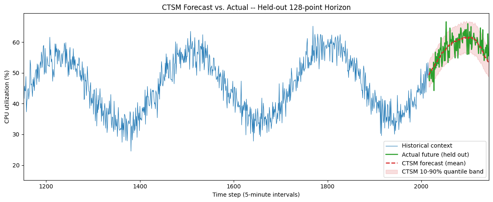
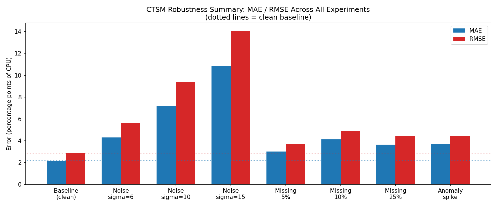
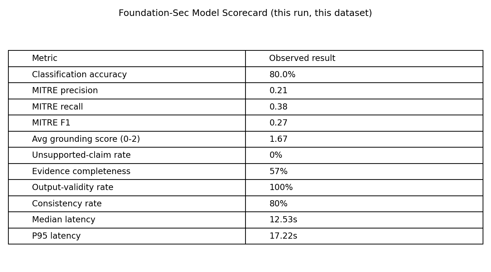
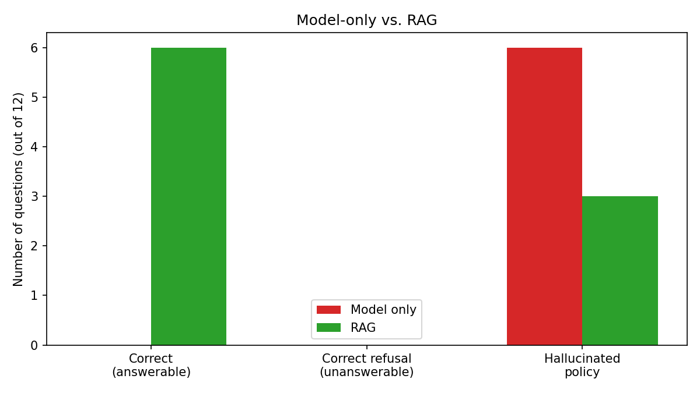
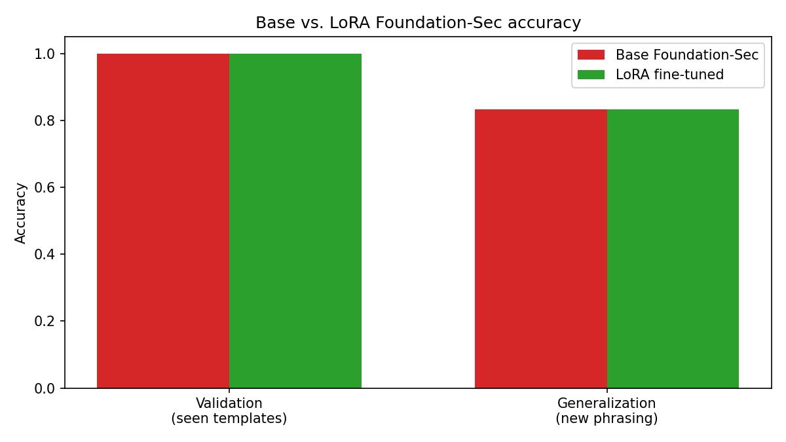

# AI Foundation Models Lab

Hands-on exploration of foundation models, evaluation, RAG, fine-tuning, local model deployment, and AI product tradeoffs from a Product Management perspective.

Every number in this README comes from a notebook that was actually executed end-to-end on the machine described in [Setup](#setup) — nothing here is estimated or asserted without a corresponding run.

## Why I built this

I wanted to move beyond treating LLM APIs as a black box and understand the foundation-model lifecycle hands-on: what "zero-shot" actually means when you run it, how a pretrained model degrades under stress, how you'd build an evaluation harness before trusting one, what retrieval-augmented generation actually changes versus what it doesn't, and what fine-tuning does and doesn't buy you. Two tracks, same discipline throughout — run the experiment, report what happened, keep the limitations attached to the result.

**Further reading:** [What should an enterprise AI foundation platform provide?](docs/ai_foundation_platform.md) · [AI product principles learned from this lab](docs/product_principles.md)

## Experiment index

| Experiment | Question | Key concept | Notebook |
|---|---|---|---|
| Cisco Time-Series Model | Can a pretrained time-series model forecast unseen telemetry zero-shot? | Zero-shot inference | [`01_ctsm_forecasting`](notebooks/01_ctsm_forecasting.ipynb) |
| Robustness | What happens to forecast quality under noise, missing data, and anomalies? | Robustness evaluation | [`02_ctsm_robustness`](notebooks/02_ctsm_robustness.ipynb) |
| Foundation-Sec | What does a domain-specialized, quantized security LLM provide out of the box? | Domain specialization / quantization | [`03_security_foundation_model`](notebooks/03_security_foundation_model.ipynb) |
| Evaluation | How do we know a security model is good enough to trust? | Golden datasets / failure-mode analysis | [`04`](notebooks/04_security_model_evaluation.ipynb) → [`07_security_model_evaluation`](notebooks/07_security_model_evaluation.ipynb) |
| Fine-tuning | When does LoRA actually change model behavior? | Parameter-efficient adaptation | [`06`](notebooks/06_llm_finetuning_lora.ipynb) (two variants, [MLX](notebooks/06_security_finetuning_lora_mlx.ipynb)) |
| RAG | How do we give a model current, organization-specific knowledge? | Grounding / retrieval | [`05`](notebooks/05_security_rag.ipynb) → [`08_security_rag`](notebooks/08_security_rag.ipynb) |

Evaluation and RAG each appear twice in this repo: 04 and 05 were the first pass (smaller dataset, simpler retrieval); 07 and 08 are a deeper second pass on the same question (larger dataset, retrieval-method comparison, failure taxonomy). Both generations are kept — the earlier notebooks aren't wrong, they're just less complete, and the progression is itself part of the story.

## Key findings

**Track 1 — CTSM (time-series forecasting)**
- CTSM performed zero-shot forecasting on a synthetic CPU-utilization series with MAE 2.18 / RMSE 2.85, no training or fine-tuning.
- Forecast error grew substantially and smoothly as injected noise increased (sigma 3 → 15: MAE 2.18 → 10.81).
- Missing-data effects were **not monotonic** in this limited experiment — 10% missing scored worse than 25% — reported as observed, not smoothed into a trend that isn't there.
- A large anomaly injected just before the forecast window measurably shifted the forecast (+1.50 MAE vs. the clean baseline).

**Track 2 — Foundation-Sec (security LLM)**
- Foundation-Sec's first evaluation pass (12 scenarios) scored 83.3% classification accuracy, 0.19/0.27/0.22 MITRE precision/recall/F1, and zero fabricated IPs, usernames, or commands across all 12 responses.
- A second, larger evaluation pass (30 scenarios, 8 independent dimensions) showed genuinely different pictures per metric on the same model: 80% classification accuracy and 100% output-validity, but only 0.27 MITRE F1 and 57% evidence completeness. No single number would have shown this.
- RAG demonstrated the gap between pretrained knowledge and organization-specific context directly: on organization-specific policy questions, the model matched the policy's wording 0/9 times unaided and 6/9 times with retrieval (strict keyword scoring), and retrieval itself never missed the right document (0/9 top-1 misses). On manual review, the other 3 RAG answers were substantively correct but shorter than the reference (one was a bare "No"), so the keyword scorer undercounted them — a scoring limitation, not a model failure. The strict 0/9 unaided figure is also conservative: on reading, the unaided model gave sensible generic answers on a couple of questions (e.g., "No" to an AI resetting credentials on its own) but was confidently wrong on organization-specific facts (e.g., rating a developer laptop "high" criticality where the policy says Medium). RAG's real gain was on organization-specific facts, not general security knowledge.
- The failure that actually occurred was abstention: neither the unaided model nor RAG ever declined to answer a question with no supporting policy (0/3 correct refusals in both conditions). With RAG, the model stated a 90-day firewall-log retention rule that appears in none of the policy documents — a real, mildly concerning result, kept in rather than smoothed over.
- LoRA fine-tuning materially improved a small general-purpose model on a narrow classification task (Qwen2.5-0.5B: 33% → 67%), but made no difference to the already-strong security-specialized model on the same task (Foundation-Sec: 100% → 100% validation, 83% → 83% generalization) — a ceiling effect, not a failed fine-tune.

Every finding above sits beside its own limitations in the notebook that produced it — see [Important caveats](#important-caveats) and each notebook's own "Limitations" section for what these numbers do and don't support.

## Product takeaways

1. **Start with the failure mode, not the AI technique.** Notebook 08's failure taxonomy separates retrieval failures, generation failures, and failure-to-abstain because each needs a different fix — and in this run the failure that actually occurred was abstention, not retrieval or reasoning. "RAG isn't working" isn't an actionable bug report.
2. **Evaluate before deciding to fine-tune.** Notebook 06's two variants show LoRA closing a real gap on one model and doing nothing on another that was already at ceiling — you can't tell which situation you're in without evaluating first.
3. **The best benchmark model may not be the best product model.** Notebook 07's 12.53s median latency is a product-blocking number for an interactive SOC workflow, independent of how good the model's classification accuracy is.
4. **Model quality must include latency, cost, grounding, and reliability, not just accuracy.** Notebook 07's 8-dimension scorecard exists because a model can score well on one axis and poorly on another simultaneously.
5. **RAG solves a different problem from fine-tuning.** Notebook 08 Section 15's comparison: RAG updates knowledge without retraining and is traceable to a source document; fine-tuning changes behavior patterns, not live knowledge.
6. **AI systems need observability across retrieval, models, tools, and outputs.** Notebook 08 Section 17's request trace (query → retrieval → scores → prompt → model version → response → latency → eval result) is what makes "why did the AI give the wrong answer" answerable after the fact instead of a guess.
7. **High-risk actions require deterministic policies and appropriate human controls.** Notebook 08 Section 14: a model can be 99% confident and still have no authority to override a hard policy — confidence and authority are different axes, and a product that conflates them will eventually let a confident model do something it shouldn't.
8. **Foundation platforms should centralize capabilities product teams should not rebuild independently.** Every capability exercised in this repo — model loading, evaluation, retrieval, fine-tuning — is something a shared platform team owns once rather than something every product team reimplements; see [docs/ai_foundation_platform.md](docs/ai_foundation_platform.md).

---

## Track 1: Time-Series Foundation Model (CTSM)

CTSM 1.0 is a 250M-parameter, Apache-2.0 licensed, decoder-only transformer released by Cisco/Splunk for **univariate zero-shot time-series forecasting** — used here exactly as published, no training or fine-tuning. Loaded via the `cisco-tsm` PyPI package, running locally on CPU/Apple Silicon (MPS).

**Baseline (01):** a synthetic CPU-utilization series (trend + daily cycle + noise) is forecast zero-shot over a 128-point held-out window.

**Result: MAE 2.176 / RMSE 2.854 (percentage points of CPU).**



**Robustness (02):** three stressors, tested one at a time against that same baseline.

- **Noise** — error grows substantially and smoothly as injected noise increases (sigma 3 -> 15: MAE 2.18 -> 10.81).
- **Missing data** — a gap is explicitly imputed via last-value-carried-forward (the method CTSM's own model card recommends) and clearly flagged, not hidden. Error rose *non-monotonically* across gap sizes (10% missing scored worse than 25%) — reported as observed, not smoothed into a trend that isn't there.
- **Anomaly** — a large spike injected just before the forecast window measurably shifted the forecast (+1.50 MAE) relative to the clean baseline.



---

## Track 2: Security-Domain Foundation Model (Foundation-Sec)

[Foundation-Sec-1.1-8B-Instruct](https://huggingface.co/fdtn-ai/Foundation-Sec-1.1-8B-Instruct) is Cisco Foundation AI's 8B-parameter, Llama-3.1-based model continued-pretrained on cybersecurity content. Run entirely locally via a **Q4_K_M GGUF quantization** and `llama-cpp-python` with Metal acceleration (03-05, 07-08) — full-precision weights alone would need ~16GB, more than this machine's unified memory has room for alongside everything else.

### Loading and first prompts (03)

Confirms the model loads and runs three simple SOC-style prompts (triage, MITRE mapping, containment recommendations) before any formal evaluation is attempted.

### Building an evaluation harness (04 → 07)

**First pass (04):** a 12-scenario synthetic golden dataset (brute force, phishing, ransomware, lateral movement, a deliberately benign case, and more), scored for classification accuracy, MITRE ATT&CK technique precision/recall, and evidence grounding.

- Classification accuracy: **83.3%** (10/12).
- MITRE technique precision/recall/F1: **0.19 / 0.27 / 0.22** — the model both over- and under-predicts techniques simultaneously; several overpredicted IDs were technique numbers MITRE deprecated years ago, a specific, checkable pattern rather than random noise.
- Grounding: **58% fully grounded, 42% unsupported**, and — across all 12 responses — **zero fabricated** IPs, usernames, filenames, timestamps, or commands. Where the model was wrong, it was vague, not confidently inventing facts.

**Second pass (07):** a larger, 30-scenario dataset across 6 categories, scored on 8 independent dimensions rather than one.

| Metric | Result |
|---|---|
| Classification accuracy | 80.0% |
| MITRE precision / recall / F1 | 0.21 / 0.38 / 0.27 |
| Avg. grounding score (0–2) | 1.67 |
| Unsupported-claim rate | 0% |
| Evidence completeness | 57% |
| Output-validity rate | 100% |
| Consistency rate (3 identical reruns) | 80% |
| Median / P95 latency | 12.53s / 17.22s |

The point isn't that these numbers are better or worse than 04's — it's that no single one of them tells the whole story, which is the notebook's own explicit argument (Section 20).



### Retrieval-augmented generation (05 → 08)

**First pass (05):** a small synthetic security-policy knowledge base (5 markdown documents) with a hand-rolled TF-IDF retriever — deliberately not a vector database, to keep every step inspectable.

- Baseline (no retrieval): **0/10 questions correct.**
- With retrieval: **3/10 correct, 3/10 partial**; retrieval found the relevant policy document 90% of the time.
- A genuine, unexpected finding surfaced by checking raw model output rather than trusting the scoring: 4 of the "wrong" RAG answers were **literally empty completions** — a distinct and arguably more dangerous failure mode than a wrong-but-visible answer.

**Second pass (08):** the same question, asked more rigorously — TF-IDF is compared directly against local semantic embeddings (`sentence-transformers` + ChromaDB, fully local, no API key or server), retrieval and generation failures are diagnosed separately, and a policy-conflict scenario is tested explicitly.

- Retrieval quality: **TF-IDF 89% top-1 accuracy vs. semantic 100% top-1** — semantic embeddings were chosen for the rest of the notebook on that evidence, not by default.
- Baseline (no retrieval): **0/9 correct** by strict keyword scoring on organization-specific questions (6/12 hallucinated policy overall). Read directly, the unaided answers were a mix: right on generic defaults (e.g., "No" to automated credential resets), confidently wrong on organization-specific facts — so the strict 0/9 overstates how far behind the unaided model was on general knowledge.
- With retrieval: **6/9 correct** by strict keyword scoring (3/12 hallucinated policy overall — all three on the unanswerable questions). Reading the other three answers directly, all were substantively correct but shorter than the reference answer (e.g., a bare "No"), so the scorer undercounted them; notebook 08 carries a correction note on this. Retrieval was never the bottleneck.
- **0/3 correct refusals** on unanswerable questions, in both the baseline and RAG conditions — the model never appropriately said "I don't know," even when instructed to and even when retrieved context didn't cover the topic.
- A conflicting-policy test (two versions of the same rule, one marked current and one marked superseded) showed the model correctly picked the current one when both were explicitly tagged with version/status metadata.



### Fine-tuning (06, two variants)

Both notebooks fine-tune a narrow 3-way security classification task (BENIGN / SUSPICIOUS / MALICIOUS) with **LoRA**, on the identical 45-example synthetic dataset, so the two are directly comparable:

| | Model | Params | Framework | Validation accuracy: base -> LoRA | Generalization accuracy: base -> LoRA |
|---|---|---|---|---|---|
| [`06_llm_finetuning_lora.ipynb`](notebooks/06_llm_finetuning_lora.ipynb) | Qwen2.5-0.5B-Instruct (general-purpose) | 494M | `transformers` + `peft` | 33% -> 67% | 33% -> 67% |
| [`06_security_finetuning_lora_mlx.ipynb`](notebooks/06_security_finetuning_lora_mlx.ipynb) | Foundation-Sec-1.1-8B-Instruct (security-specialized) | 8.03B | MLX + `mlx-lm` (4-bit) | 100% -> 100% | 83% -> 83% |

The comparison is itself the finding: the general-purpose model needed fine-tuning to get anywhere useful on this task; the security-specialized model was already excellent at it zero-shot, and fine-tuning had essentially nothing left to improve. Getting the second row required actually diagnosing two real bugs along the way (a LoRA scale-convention mismatch between `peft` and MLX, and a learning rate 20x too high for MLX's convention) rather than accepting the first broken result — both are documented in the notebook exactly as found.



**Why MLX, not the standard `transformers` + `peft` + `bitsandbytes` path used for the small model:** `bitsandbytes`' Apple Metal backend is marked "under construction" in its own official compatibility table (checked directly). MLX is Apple's own array framework, built for exactly this unified-memory hardware, and its `mlx-lm` library supports LoRA on 4-bit-quantized models natively.

---

## Important caveats

Every experiment here is **exploratory, not a benchmark**:

- CTSM's experiments run on one synthetic, single-seed series; nothing is claimed to generalize past the exact settings tested (notebook 02's own "Observations" section states this explicitly).
- The security golden datasets (12 and 30 scenarios, across notebooks 04 and 07) and RAG question sets (10 and 12, across notebooks 05 and 08) are small and hand-authored by one person, not reviewed by a SOC analyst or drawn from real incidents.
- Free-text answers are scored by transparent keyword-overlap heuristics, not human review. Notebook 08's own manual read-through showed the heuristic undercounting terse-but-correct answers, so a "partially correct" label there means "shorter than the reference," not necessarily "wrong" — in the unaided baseline, that label covered both wrong answers and correct-but-generic ones.
- Fine-tuning used ~36-45 synthetic training examples — enough to demonstrate the mechanism, not to certify production classification behavior.
- ChromaDB (notebook 08) is used in local, in-memory mode for a retrieval-method comparison — no persistence, scale, or production deployment concerns were tested.
- No customer data, no real threat intelligence, and no real vulnerability data appear anywhere in this repo; every IP address uses RFC 5737 documentation ranges, every CVE-shaped identifier is an explicitly fictional placeholder, and every policy document is marked synthetic in its own text.
- `Foundation-Sec-1.1-8B-Instruct-mlx-4bit` (used in the MLX fine-tuning notebook) is a third-party community conversion, not an official Cisco/Foundation AI release — the underlying weights and license terms were verified to match the official model, but the conversion itself is unaudited here.

## Setup

Requires Python 3.11 (a hard constraint of the `cisco-tsm` package).

```bash
python3.11 -m venv .venv
source .venv/bin/activate
pip install -r requirements.txt
python -m ipykernel install --user --name=ai-foundation-models-lab --display-name "Python 3.11 (ai-foundation-models-lab)"
```

Then open any notebook in Jupyter and select the **"Python 3.11 (ai-foundation-models-lab)"** kernel. Model weights download from Hugging Face on first run and are cached locally afterward (CTSM ~250M params; Foundation-Sec GGUF ~4.9GB; Foundation-Sec MLX 4-bit ~4.5GB; Qwen2.5-0.5B ~1GB).

This lab intentionally uses several different local-inference approaches depending on what each notebook needed, all installed by the one `requirements.txt`:

- `cisco-tsm` (notebooks 00-02) -- PyTorch/MPS, for a 250M model.
- `llama-cpp-python` (notebooks 03-05, 07-08) -- GGUF quantized inference via Metal, for the 8B security model (full precision wouldn't fit in 16GB).
- `transformers` + `peft` (notebook 06) -- standard LoRA fine-tuning, for a 494M model where full-precision weights comfortably fit.
- `mlx` + `mlx-lm` (notebook 06 MLX variant) -- Apple's native framework, the only path found that supports LoRA fine-tuning of a 4-bit-quantized 8B model on this hardware.
- `chromadb` + `sentence-transformers` (notebook 08) -- fully local semantic embedding retrieval, compared directly against the hand-rolled TF-IDF used in notebook 05.

## Project structure

```
ai-foundation-models-lab/
│
├── README.md
├── LICENSE
├── requirements.txt
├── .gitignore
│
├── data/
│   ├── security_knowledge/          # synthetic policy docs used by notebook 05's RAG index
│   │   ├── incident_response_policy.md
│   │   ├── authentication_policy.md
│   │   ├── endpoint_response_policy.md
│   │   ├── threat_intelligence_policy.md
│   │   └── asset_criticality.md
│   │
│   └── security_knowledge_acme/     # synthetic Acme Corp policy docs used by notebook 08's RAG index
│       ├── incident_response_policy.md
│       ├── authentication_policy.md
│       ├── endpoint_response_policy.md
│       ├── privileged_access_policy.md
│       └── asset_criticality.md
│
├── notebooks/
│   ├── 00_verify_setup.ipynb
│   ├── 01_ctsm_forecasting.ipynb
│   ├── 02_ctsm_robustness.ipynb
│   ├── 03_security_foundation_model.ipynb
│   ├── 04_security_model_evaluation.ipynb
│   ├── 05_security_rag.ipynb
│   ├── 06_llm_finetuning_lora.ipynb
│   ├── 06_security_finetuning_lora_mlx.ipynb
│   ├── 07_security_model_evaluation.ipynb   # deeper second pass on 04
│   └── 08_security_rag.ipynb                # deeper second pass on 05
│
├── results/                          # all plots referenced above, plus a few more per-notebook
│
├── docs/
│   ├── ai_foundation_platform.md    # what a shared AI platform layer should provide
│   └── product_principles.md        # PM principles this lab surfaced, tied to specific experiments
│
└── scripts/
    └── make_robustness_summary_plot.py
```
