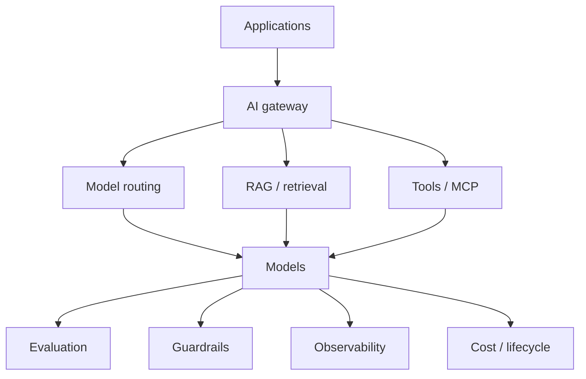

# What should an enterprise AI foundation platform provide?

> This is a product-architecture thinking artifact written to organize what this lab's experiments actually surfaced — it is **not** a description of Cisco's, Splunk's, or any employer's internal architecture, and no proprietary information appears in it.

Every notebook in this repo exercises one capability that, in a real organization, gets used by many product teams at once: loading a model, evaluating it, retrieving grounding context for it, fine-tuning it. Built once per team, each of these becomes inconsistent, unmaintained, and eventually a liability (an evaluation harness nobody trusts, a RAG pipeline with no access control, a fine-tune nobody can reproduce). Built once centrally and consumed as a platform capability, they become something a domain team can rely on instead of re-deriving.

## A simple reference architecture

Reading it top to bottom: an application never calls a model directly. It calls a gateway, which decides which model handles the request, what context retrieval or tools that request needs, and which model version actually serves it. Every response — and everything that produced it — flows back through evaluation, guardrails, observability, and cost tracking before the loop closes. None of that middle and bottom layer is application-specific; it's the same shape whether the application is a SOC assistant, a support-ticket summarizer, or a forecasting dashboard.

## Capabilities a platform team should centralize

- **Model gateway** — a single entry point for every model call, so routing, auth, and rate limiting live in one place instead of every application reimplementing them.
- **Approved model registry** — which models (and which versions) are cleared to use, with their known limitations attached, not rediscovered per team.
- **Routing** — sending a request to the model that fits its cost/latency/quality tradeoff, not always the newest or largest one.
- **Prompt/template management** — versioned, reviewable, not hardcoded strings scattered across application code.
- **RAG infrastructure** — a retrieval pipeline (chunking, embedding, indexing, retrieval-quality evaluation) built once, not five times with five different bugs.
- **Connector/tool registry** — an approved, audited list of what an AI system is allowed to call out to, and with what permissions.
- **Evaluation framework** — golden datasets, scoring harnesses, and regression testing as shared infrastructure, so every team isn't inventing its own definition of "good enough" (notebooks 04 and 07 are a small-scale version of exactly this).
- **Guardrails** — the deterministic policy layer that a model's confidence is not allowed to override (notebook 08, Section 14's authority-vs-confidence distinction is the argument for why this can't be left to prompting alone).
- **Observability** — logging every stage of a request (query, retrieval, context, model version, response, latency, eval result) so a wrong answer is diagnosable after the fact, not a mystery (notebook 08, Section 17).
- **Cost management** — visibility into what each model call actually costs, at the routing decision, not discovered on a bill afterward.
- **Versioning** — of models, prompts, and retrieval indexes, so "what changed" is answerable when behavior changes.
- **Rollout / rollback** — the ability to ship a model or prompt change to a fraction of traffic and pull it back the moment a regression shows up.
- **SDKs** — a consistent client library so application teams integrate against a stable interface instead of the gateway's raw API shifting under them.

## Who owns what

**The foundation/platform team owns the reusable capabilities above** — the gateway, the registry, the shared RAG and evaluation infrastructure, guardrails, observability, cost, versioning, rollout. These are hard to get right, expensive to duplicate, and dangerous to get subtly wrong five different ways across five different teams.

**The domain/application team owns:**
- the end-user workflow — what a SOC analyst, a support agent, or a forecasting dashboard user actually sees and does;
- domain logic — what "compromised account" or "impossible travel" specifically means for this workflow;
- product-specific UX — how a suggestion is surfaced, confirmed, or overridden;
- domain-specific success metrics — investigation correctness and analyst trust, not raw model accuracy (see notebook 07, Section 17's model-metric-to-business-metric table for a worked example of this distinction).

The dividing line isn't "who's allowed to touch AI" — it's that a domain team should never need to re-derive an evaluation methodology, a retrieval pipeline, or an observability trace from scratch to ship a workflow. That's the platform's job, once.
